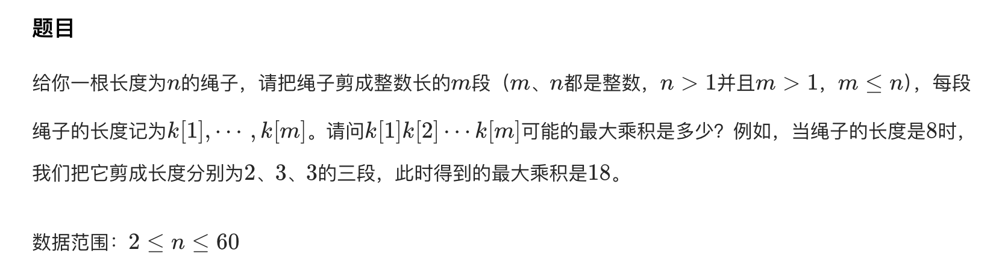
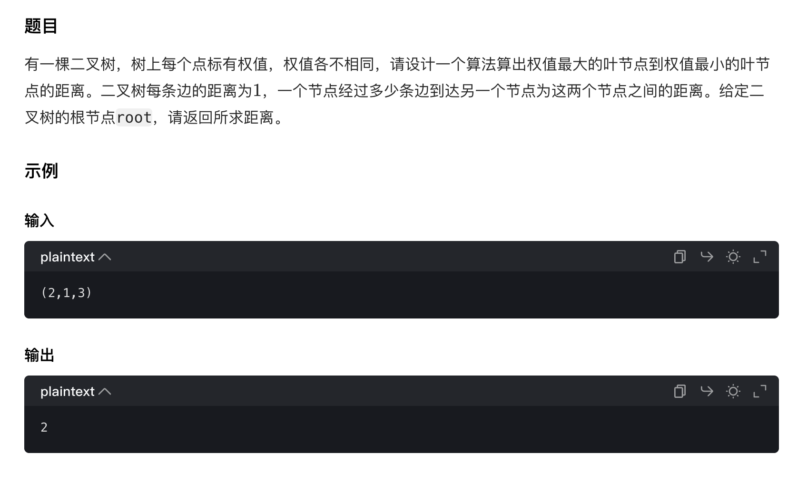

# 剪绳子

## 题目描述


### 思路：动态规划

```java
import java.util.Scanner;

public class Main {
    public static void main(String[] args) {
        Scanner sc = new Scanner(System.in);
        int n = sc.nextInt();

        // dp[i] 表示长度为 i 的绳子剪成若干段后的最大乘积
        int[] dp = new int[n + 1];
        dp[2] = 1;

        for (int i = 3; i <= n; i++) {
            for (int j = 1; j < i; j++) {
                // 两种情况：只剪一次 / 继续剪
                dp[i] = Math.max(dp[i], Math.max(j * (i - j), j * dp[i - j]));
            }
        }

        System.out.println(dp[n]);
    }
}
```

#### 复杂度分析
时间复杂度：O(n^2) ——（两层循环，外层长度 n，内层枚举分割点）

空间复杂度：O(n) ——（仅使用一个数组存储 dp 状态）

----

# [盛最多水的容器](盛最多水的容器"[题目地址](https://leetcode.cn/problems/container-with-most-water/description/)")

## 题目描述
给定一个长度为 n 的整数数组 height 。有 n 条垂线，第 i 条线的两个端点是 (i, 0) 和 (i, height[i]) 。

找出其中的两条线，使得它们与 x 轴共同构成的容器可以容纳最多的水。

返回容器可以储存的最大水量。

说明：你不能倾斜容器。

### 思路：双指针


```java
class Solution {
    public int maxArea(int[] height) {
        int left = 0, right = height.length - 1;
        int res = 0;

        while(left < right){
            int width = Math.min(height[left], height[right]);
            int len = right - left;
            int area = width * len;

            res = Math.max(res, area);

            if(height[left] < height[right]){
                left++;
            }else{
                right--;
            }
        }

        return res;
    }
}
```

#### 复杂度分析
时间复杂度：O(n)

空间复杂度：O(1)

----

# 两叶子节点距离

## 题目描述


### 思路：最近公共祖先🌟


```java
// Java代码
```

#### 复杂度分析
时间复杂度：

空间复杂度：
